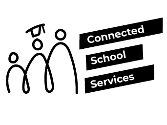
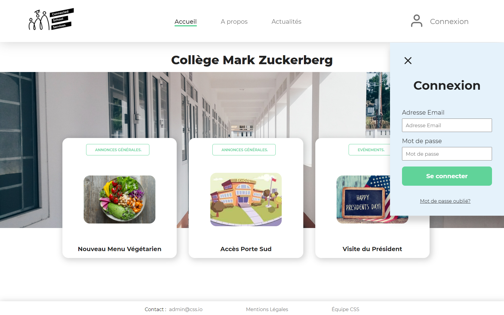
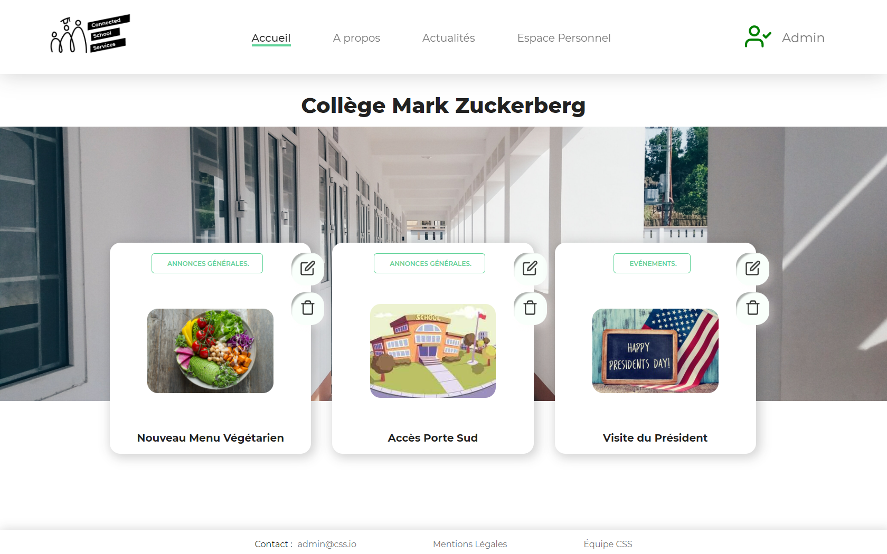
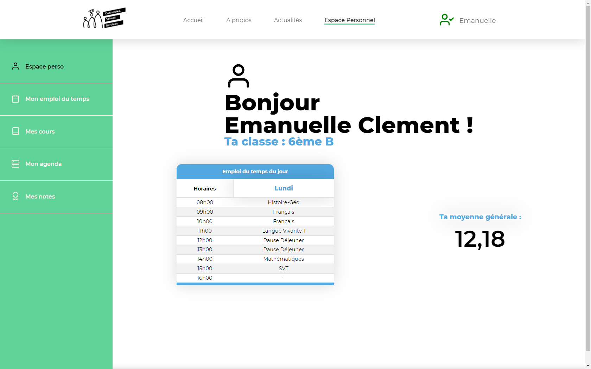
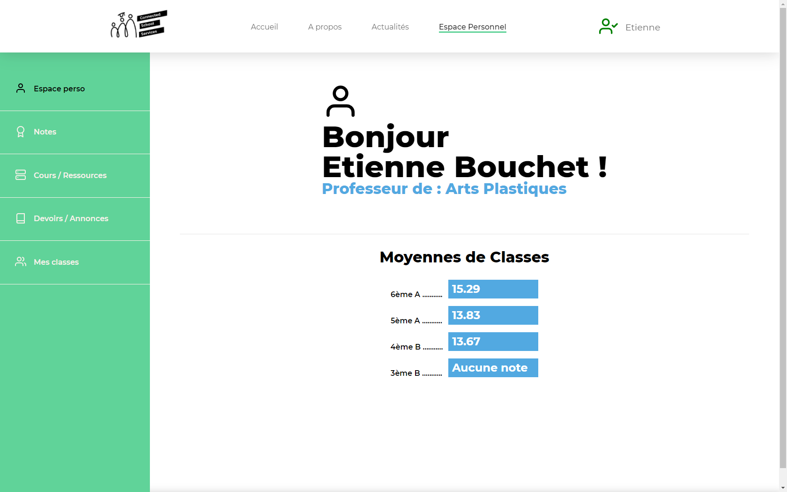
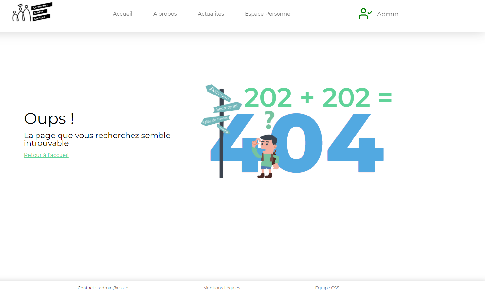

# Connected School Services

Projet de fin de formation réalisé en équipe Agile de 5 personnes durant 3 semaines.

**Technologies** :  React / Symfony

---

## Description

Connected School Services est une application multifonctions qui permet de regrouper toutes les interactions et communications qui peuvent se faire entre un étudiant (les parents pour les plus jeunes élèves), l’établissement scolaire et ses professeurs.

---

### Quelques exemples de fonctionnalités :

Connexion

Annonces de l’établissement

Elèves – Accueil

Elèves - Emploi du temps

Professeur – Accueil

Professeur – Gestion des notes

Administration – Accueil

Administration – Gestion de Classe

Page 404

